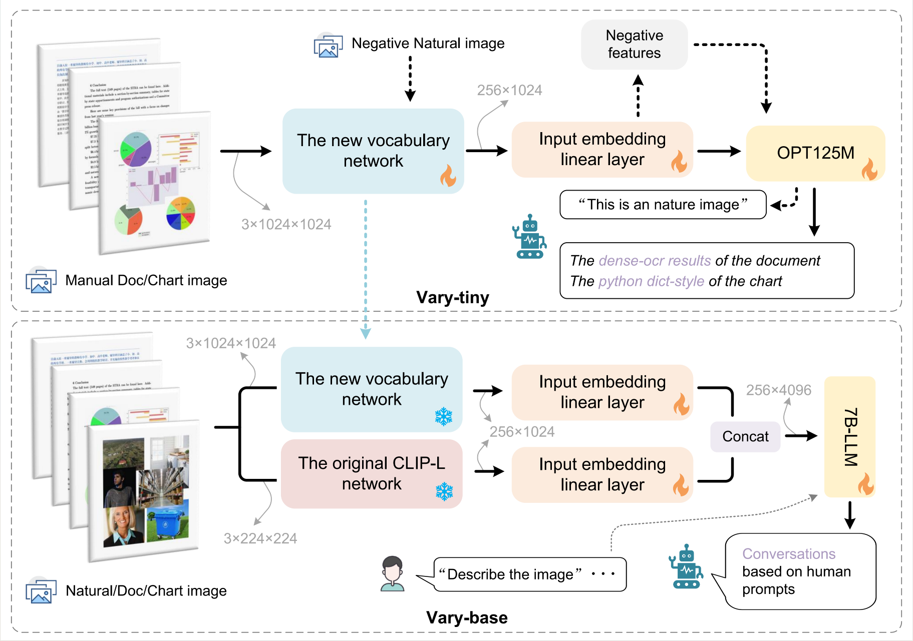

#  Vary

<h3><a href="">Vary: Scaling up the Vision Vocabulary for Large Vision-Language Models</a></h3>

[Haoran Wei](https://scholar.google.com/citations?user=J4naK0MAAAAJ&hl=en)
	
<a href="https://varybase.github.io/"></a>
<a href="https://arxiv.org/abs/2309.11499"></a> 

Vary is an efficient and effective method to scale up the Vision vocabulary of LVLMs. 
                    The procedures of Vary is naturally divided into two-folds: the generation and integration of a new vision 
                    vocabulary. In the first phase, we devise a "vocabulary network" along with a tiny decoder-only 
                    transformer to produce the desired vocabulary via autoregression. In the next, we scale up the vanilla 
                    vision vocabulary by merging the new one with the original one (CLIP), enabling the LVLMs can quickly 
                    garner new features. 



Code, model weights, and demo will be released soon.


## Contact
If you have any questions related to the code or the paper, feel free to email Haoran Wei (`xxx.xxx@xxx.com`).

## License
Our model and weights are licensed for both researchers and commercial entities, upholding the principles of openness. The license is drafted by modification of the license of [LLaMA](https://github.com/facebookresearch/llama).

See the [LICENSE](./LICENSE), as well as our accompanying [Acceptable Use Policy](./USE_POLICY.md).

## Citation

If you find our work useful in your research, please consider citing Vary:
```tex
@article{dong2023dreamllm,
  author = {Dong, Runpei and Han, Chunrui and Peng, Yuang and Qi, Zekun and Ge, Zheng and Yang, Jinrong and Zhao, Liang and Sun, Jianjian and Zhou, Hongyu and Wei, Haoran and Kong, Xiangwen and Zhang, Xiangyu and Ma, Kaisheng and Yi, Li},
  title = {DreamLLM: Synergistic Multimodal Comprehension and Creation},
  journal = {arXiv preprint arXiv:2309.11499},
  year = {2023},
}
```
